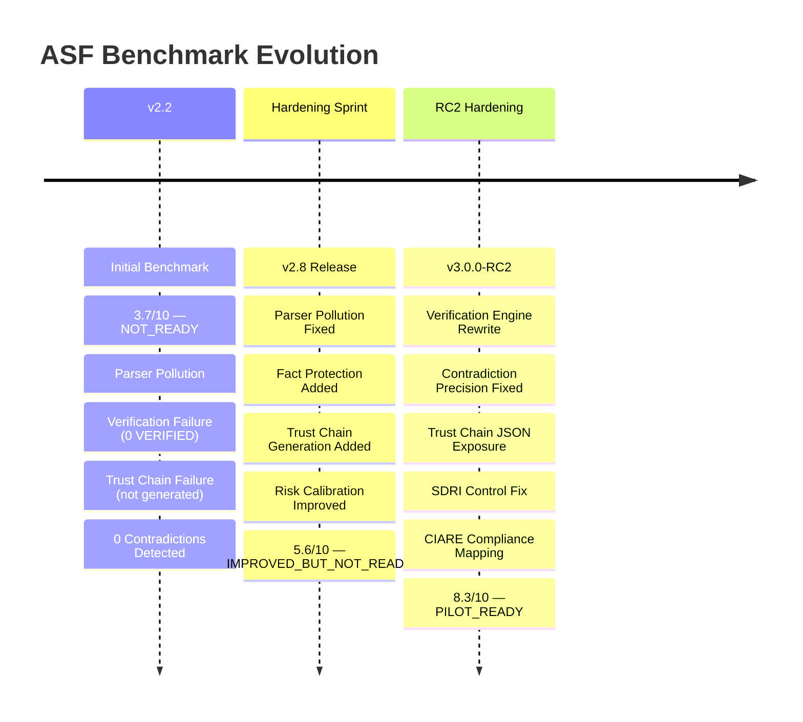

# ASF Benchmark Timeline



---

## Detailed Timeline

### Phase 1: Initial Baseline — v2.2

```
2026-06-13: Initial benchmark conducted
Score: 3.7/10
Verdict: NOT_READY
```

**State:**
- Parser leaked YAML comments as assumptions
- No fact protection (invented TLS/MFA for insecure architectures)
- Verification engine returned 0 VERIFIED
- Trust chain generation absent
- Contradiction detection absent
- 48 assumptions, 8 categories, ~15% recall

**Blocking issues:**
1. Parser pollution
2. Verification non-functional
3. Trust chain absent
4. Contradiction detection absent

---

### Phase 2: Hardening Sprint — v2.8

```
2026-06-13: Targeted re-benchmark conducted
Score: 5.6/10
Verdict: IMPROVED_BUT_NOT_READY
```

**State:**
- Parser pollution fixed — PASS
- Fact protection added — PASS
- Trust chain generation working (100 chains) — PASS
- Verification still broken (0 VERIFIED) — FAIL
- Contradiction precision at 17% (58 for 4 expected) — FAIL
- Trust chain data hidden from CLI JSON — FAIL
- SDRI ignoring declared controls — FAIL

**Remaining blockers:**
1. Verification engine non-functional (2/10)
2. Contradiction precision (4/10)
3. Trust chain CLI exposure (7/10)
4. SDRI control awareness (3/10)

**Verdict:** Do not ship to customers.

---

### Phase 3: RC2 Hardening — v3.0.0-RC2

```
2026-06-13: RC2 certification benchmark conducted
Score: 8.3/10
Verdict: PILOT_READY
```

**State:**
- All 4 workstreams provably fixed:
  - Verification engine: 11 VERIFIED + 4 PARTIAL (was 0+1)
  - Contradiction precision: 6 total (was 58)
  - Trust chain CLI exposure: 100 chains, 25 cascades, 19 SPOFs in JSON
  - SDRI control awareness: 10 YAML controls consumed
- All regression gates PASS
- Release certified RELEASE_CANDIDATE_CERTIFIED

**Residual (non-blocking):**
- CIARE 0% coverage (architectural limitation)
- 17 UNKNOWN (later reduced to 0 after categoryMap fix)

---

### Pending Evaluation

```
Hostile Claude Evaluation
Status: Pending
```

---

## Visual Score Progression

```
Score
10 |                                        ● 8.3 (RC2)
 9 |
 8 |
 7 |
 6 |                    ● 5.6 (v2.8)
 5 |
 4 | ● 3.7 (v2.2)
 3 |
 2 |
 1 |
 0 +----------------------------------------------
      v2.2              v2.8            v3.0.0-RC2
```
